# GTFS2 Live Card

A Lovelace card for the [gtfs2](https://github.com/vingerha/gtfs2) Home Assistant integration. It shows the next departures of one or several transit lines, chains lines into journeys with their changes, and draws the lines and their live vehicles on a map.

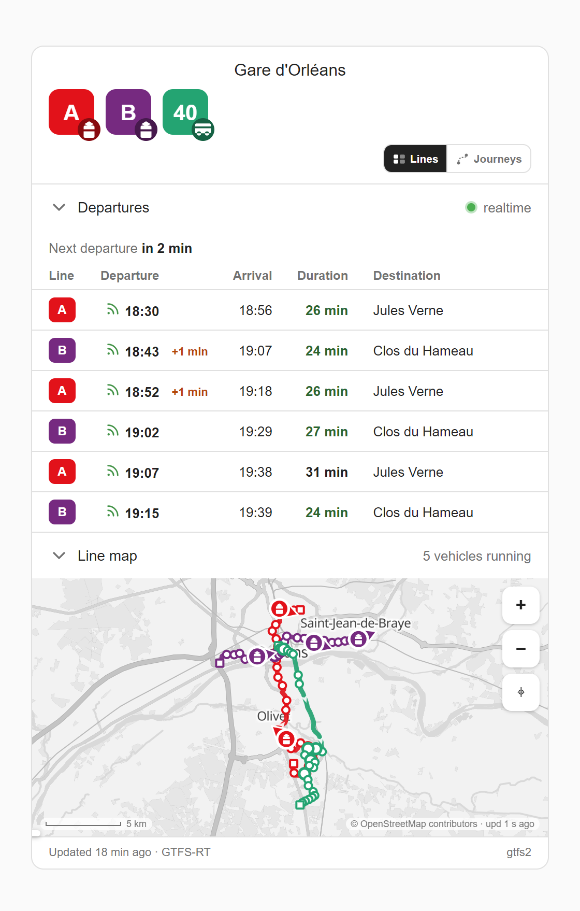

*Trams A and B and bus 40 at Gare d'Orléans, on the TAO network in Orléans. Real lines, real shapes, real vehicles: every screenshot is the card itself, fed a frozen snapshot of the network's open data (see [docs/CAPTURES.md](docs/CAPTURES.md)).*

## Contents

- [Features](#features)
- [Requirements](#requirements)
- [Installation](#installation)
- [Getting started](#getting-started)
- [Lines and journeys](#lines-and-journeys)
- [The header](#the-header)
- [The departures board](#the-departures-board)
- [The map](#the-map)
- [Chip and badge marks](#chip-and-badge-marks)
- [Options](#options)
- [Visual editor](#visual-editor)
- [Translating](#translating)
- [Limitations](#limitations)

## Features

- **Departures board**: scheduled and realtime times from one or several gtfs2 sensors on one board, delays, day tags beyond today, arrival time and journey duration, as a list or as a timetable.
- **Journeys**: say where you go and the card finds the ways on your lines, changes included, on foot or at the same stop, and the return with them. The board shows every run you can actually take, first to leave first, and a timeline shows each change.
- **Two ways to read the header**: *Lines*, one badge per line; *Journeys*, where you are leaving from, where you can go from there and how.
- **Line map**: a vector base map that follows the Home Assistant theme, the route shapes and their stops, the realtime vehicles with their mode and heading, and the journey you picked drawn stop by stop.
- **Vehicle tracking**: tap a vehicle to follow it, with its terminus, its next stop and its speed.
- **Honest about the feed**: a cancelled run or one not stopping stays on the board, struck through. Operator alerts sit on the runs they name. A line that runs neither today nor for days says when it is back, and a realtime source that goes quiet is flagged instead of freezing its vehicles on the map.
- **Minimal YAML**: a list of sensors is enough. The line name, its official colour, its mode, its files and its stops all come from the sensor. They are remembered, so a line out of service at night keeps its identity.
- **Visual editor** covering the whole configuration. The card and its editor speak the language of your Home Assistant profile: English, French, German, Spanish or Portuguese.

## Requirements

- Home Assistant with the [gtfs2](https://github.com/vingerha/gtfs2) integration and at least one start/stop sensor.
- **gtfs2 0.5.9.8 or later** exports each line's shape and ordered stops, which the map and the journey chaining need. The card finds these files on its own. On an older gtfs2 the map falls back on each vehicle's recent path, dashed.
- **Live vehicles** need a GTFS-RT source with the `vehicle_positions > local file` output enabled. Without realtime the card still shows the board, the shapes and the stops.

Some features read attributes that gtfs2 does not publish yet. They are written and proposed upstream, and run today on the `ext/rt-per-source` branch of [Pulpyyyy/gtfs2](https://github.com/Pulpyyyy/gtfs2/tree/ext/rt-per-source). On a stock gtfs2 these features simply do not show; nothing breaks.

| Feature | Stock gtfs2 | Needs `ext/rt-per-source` |
|---|---|---|
| Board, delays, map, shapes, stops, vehicles, tracking | ✓ | |
| Journeys chained on the timetable of the route shape | ✓ | |
| Every clock of a journey taken from the run itself, realtime included (leg file) | | ✓ |
| A change found past the ten runs a sensor lists, up to two days ahead (timetable file) | within the ten listed runs | ✓ |
| Journey duration from gtfs2 (`show_duration`, table layout) | derived from arrival times | ✓ |
| Realtime paired with its own trip, whatever the delay | within 10 min | ✓ |
| Cancelled runs and runs not stopping, struck through | | ✓ |
| Alerts on the runs they name, alert kinds (works, incident) | line alert only | ✓ |
| Resting line: "resumes tomorrow", "resumes in *n* days" | | ✓ |
| Runs that take nobody on or set nobody down at a stop | | ✓ |
| A replacement coach on a train line shown as a coach | | ✓ |
| Files named by the sensor instead of derived | derived from route and direction | ✓ |

## Installation

### HACS (recommended)

1. HACS, three-dot menu, **Custom repositories**: add `https://github.com/Pulpyyyy/gtfs2-live-card`, category **Dashboard**.
2. Search for **GTFS2 Live Card**, install, and reload when prompted.

### Manual

1. Copy `dist/gtfs2-live-card.js` **and the `dist/lang/` folder** into `config/www/`. The card loads its languages from `lang/`, next to itself.
2. Settings, Dashboards, **Resources**: add `/local/gtfs2-live-card.js` as a *JavaScript module*.

## Getting started

A list of gtfs2 sensors is a complete card:

```yaml
type: custom:gtfs2-live-card
title: Gare d'Orléans
lines:
  - sensor.gare_orleans_tram_a
  - sensor.halmagrand_tram_b
  - sensor.gare_orleans_bus_40
```

That is the card at the top of this page. Any entry can be an object that overrides what the card derives:

```yaml
lines:
  - entity: sensor.gare_orleans_bus_40
    line: "40"                    # badge label (default: route_short_name)
    color: "#24a472"              # line colour (default: route_color)
```

## Lines and journeys

`lines` lists the sensors you ride, each once. `trips` says where you go. The card finds the ways itself, changes included, and the return with them:

```yaml
type: custom:gtfs2-live-card
title: My trips
places:
  Gare d'Orléans: [Gare d'Orléans - Quai E, Orléans]   # the bus stop and the station, one place
  Austerlitz: [Paris Austerlitz, Gare d'Austerlitz]    # the train and the metro name it apart
lines:
  - sensor.saint_euverte_bus_40
  - sensor.gare_orleans_bus_40
  - sensor.orleans_train_paris
  - sensor.paris_train_orleans
  - sensor.austerlitz_metro_5
  - sensor.place_italie_metro_5
trips:
  - [Saint-Euverte, Paris Austerlitz]                  # the bus 40, then the train
  - [Saint-Euverte, Place d'Italie]                    # the bus, the train, the metro
  - { from: Les Aubrais, to: Paris Austerlitz, name: Paris }   # the train, boarded on its way
```

A trip goes from a place to another, both ways round. Either end may be any stop a line of the card calls at: the train boarded at Les Aubrais, a stop on its way from Orléans, is the same sensor cut where you get on. The card reads the stops of every line from the route shape gtfs2 exports, and a change can be made wherever two lines call at the same place, as `places` reads it. A change between two stops of one place is a walk, timed on the distance between them; at the same stop it is direct. Each leg is taken on its first run that leaves after the arrival plus the walk, and a change that would wait longer than `max_transfer_wait` (120 min by default) is not offered.

The ways offered are the ones a rider would take:

- none passes the same place twice, and none rides the same sensor twice;
- none gets off a vehicle that goes on to where the next one is left: staying on is the same way;
- none boards a vehicle after it went through a place the way has already been: it could have been boarded there;
- where two lines share a stretch, as metros 4 and 6 share Denfert-Rochereau and Raspail, every station of it is a change, and the board keeps, for each departure, the one that arrives first, the one with the shorter walk when they tie;
- no way has more than `max_changes` changes (5 by default).

A trip may take a `name`, the destination it belongs to in the *Journeys* header, and a `destination_color`. A card without trips has no journeys: its lines share one departures board.

The board then lists the runs of all trips in one column, first to leave first, `max_departures` in all. Each row is tagged with its line and its ends. A journey with a change opens into a timeline: each leg in its line's colour, its numbered points and their clocks, the walk and the wait at each change, the arrival and the total time. The map draws the stretch of each line you ride, the walk between the two stops, and a numbered disc on every point.

The first run you can take is always shown, even when a later one would arrive sooner. With the leg files of `ext/rt-per-source` (see [Requirements](#requirements)), every clock is the run's own, in bold when it comes from the realtime feed. Without them, a journey is timed on the timetable exported with the route shape.

A long trip needs its later legs well ahead: a metro every four minutes lists its next forty minutes, and the train before it may arrive an hour and a half later. With the timetable files of `ext/rt-per-source`, the card reads a leg's runs past the sensor's list, on schedule, up to two days ahead; when no run is left in them it says when the next one is, or that none is published yet. Without them, a leg ends where its sensor's list does, and the note under the board says how far that is.

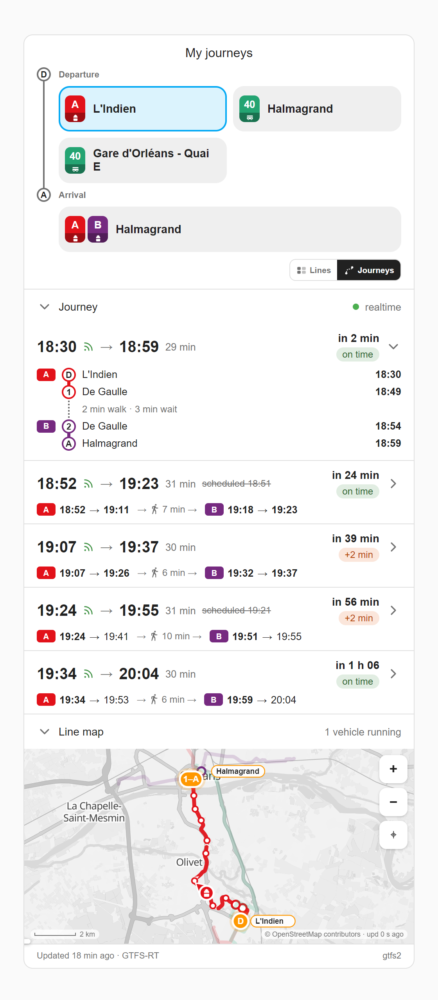

*Two trips on one board by departure time: L'Indien to Halmagrand, which the card rides on tram A then tram B, and bus 40 from the station. The change opens on its timeline, and the map numbers its points.*

## The header

The header reads the card in one of two ways, switched by the **Lines / Journeys** toggle in its bottom right corner. The card opens on *Journeys* as soon as one entry is more than a plain line, on *Lines* otherwise. The choice is then remembered per browser.

### Lines

One badge per line, in its official colour, with its mode and its state marks (see [below](#chip-and-badge-marks)). Tap a badge to keep that line's departures alone on the board, raise its shape above the others on the map, pin its two ends and keep only the vehicles running the departures on the board. Tap it again, or the chip in the departures pane's head, to go back to all lines.

In this view, the departures of a line also give their time at the stops where your trips get on it or off it on its way, Les Aubrais on a train from Orléans a trip boards there: under the row in the list, in a **Via** column in the table.

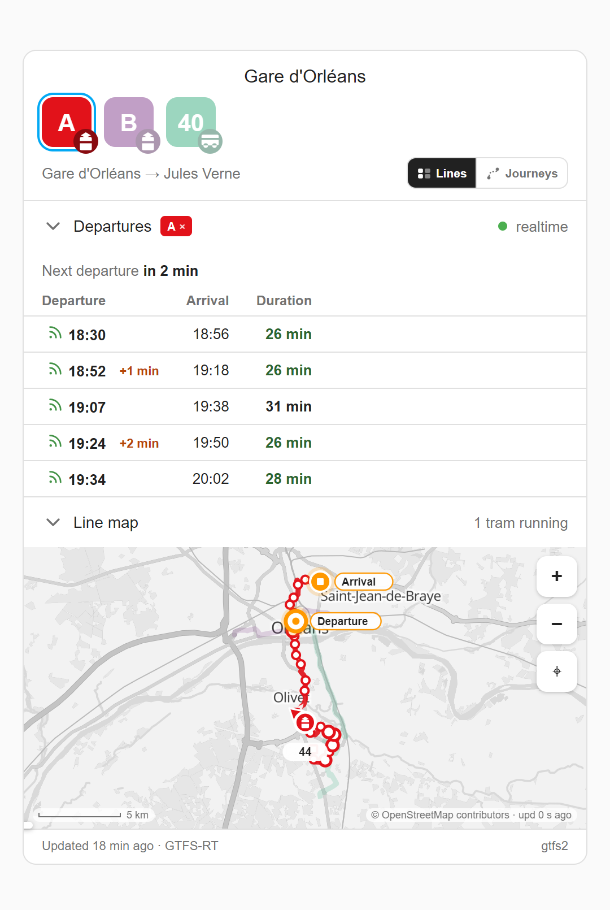

*Tram A picked from its badge: the board keeps its departures only, and the map raises its shape, pins its ends and keeps only the tram running the first of those departures.*

### Journeys

The header asks where you are going. It has two rows, marked **D** and **A** like the ends of a journey:

- **Departure**: every place your trips start from, the most used first. That one is picked until you pick another. Tap the picked departure again to see everything.
- **Arrival**: one chip per place reachable from that departure. The chips carry no time, since no journey is chosen yet; a chip only says when nothing runs from it any more. Trips that share a `name` are one arrival. An unnamed trip is named after where it ends.

Tap an arrival to list its **ways to leave**: *Direct* for a single sensor, *Via* the line a change starts with, or *Then* the line it ends with when every way starts on the same line. Each way shows its next departure and the alert mark that sets it apart. A way with no run says why: a line resting today, a change that would wait too long, a stop the runs do not call at. A way is also a filter of the board; tap it again to clear it.

The departure, the arrival and the way are your own choices, never the clock's, and are remembered per browser.

A **return** needs no key of its own: every trip is searched both ways round, and the return shows up under its own departure.

```yaml
type: custom:gtfs2-live-card
lines:
  - sensor.saint_euverte_bus_40
  - sensor.gare_orleans_bus_40
  - sensor.orleans_train_paris
  - sensor.paris_train_orleans
trips:
  - from: Saint-Euverte
    to: Paris Austerlitz
    name: Paris
    destination_color: "#7b3b8f"              # optional: the chip's colour
places:
  Gare d'Orléans:                             # platforms the feed keeps apart, as one place
    - Gare d'Orléans - Quai E
    - Gare d'Orléans - Quai M bis
    - Orléans
```

Places are compared on their names, without case, accents or punctuation, because a station often has one stop per platform. When the feed files the platforms under different names with nothing grouping them, `places` makes them one: each key is the name shown, its list the stops it stands for.

A chip starts with a plate per line it rides, in riding order, each with its number on the line's colour and its mode on a band at the foot; past two lines, a *+n* says how many more. `destination_color` on a trip paints its arrival's plates in that colour.

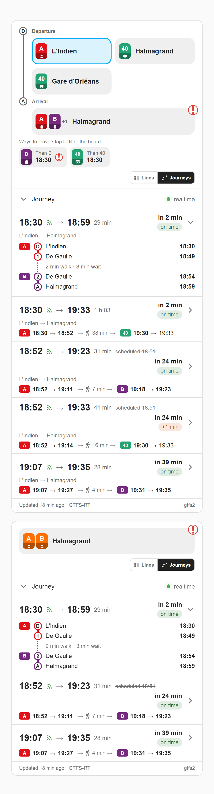

*Above, trips leaving from three places: from L'Indien, the card reaches Halmagrand two ways, tram A then tram B, or tram A to the station then bus 40, and the chip carries the alert of the tram B; the return, by bus 40, files itself under Halmagrand. Below, a card with a single destination: its ways to leave are listed straight away, and its colour is set with `destination_color`.*

## The departures board

Each row gives the departure time, a realtime mark when the feed confirms it, the line and its destination, a countdown and a delay chip (*on time*, *+2 min*). A realtime time is paired with its own trip's scheduled slot, and the scheduled time shows struck through beside it when they differ. Departures beyond today carry their day.

- `show_duration: true` adds the arrival time and the journey duration to each row ("→ 07:07 · 1 h 04").
- In the Lines view the board is a timetable: line, departure (with its realtime mark and delay), arrival, duration and destination columns, sorted by departure time, under a line giving the next departure. Each duration is coloured in three steps against the fastest run to the same destination. On a wide card the columns spread over its width; on a phone the destination wraps rather than scrolling sideways. The Journeys view is a list.
- A departure ridden by another mode than its line, a replacement coach on a train line, shows that mode's glyph beside its time.

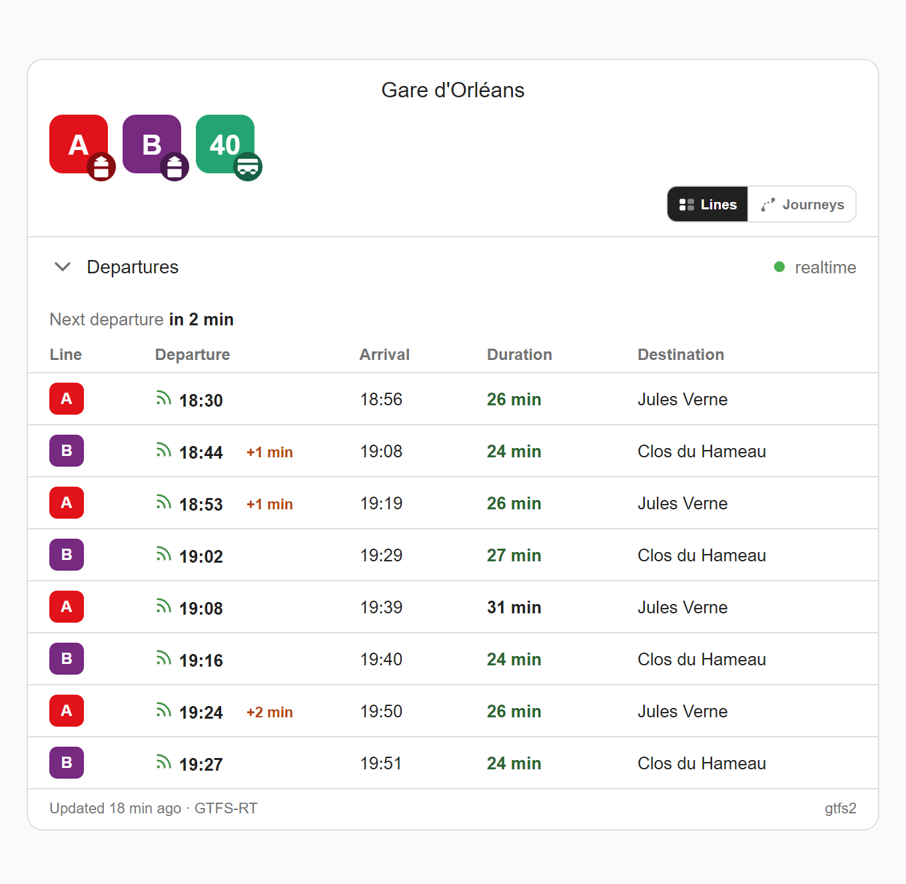

*The departures as a timetable, in the Lines view.*

### What the feed strikes out

A run the realtime feed cancels, or that will not stop at your stop, stays on the board for five minutes past its time, struck through, with *cancelled* or *not stopping here* in place of its countdown, instead of silently vanishing. On a journey's timeline, a stop the run skips today says so in place of its clock.

An operator alert that names runs carries its mark on those rows, with its sentence in the tooltip and in the strip under the board. An alert that names every run of its line on the board marks no row; the strip says it once.

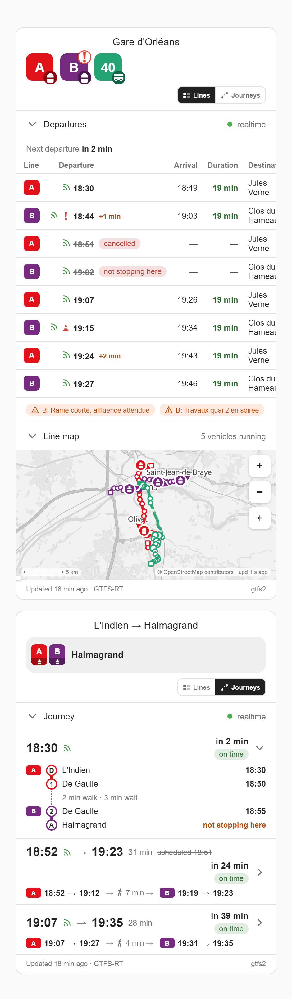

*The second tram A is cancelled, the second tram B will not stop here, two alerts name the trams they concern, and on a trip with a change the stop the first tram B skips takes the place of its clock.*

### Boarding and alighting

A run that takes nobody on where you board, or sets nobody down where you get off, is not a way to make that journey. The card never offers one, and never hides a run that works:

- a stop where no run of a line takes anybody on is never where a way boards it, nor one where none sets anybody down where a way leaves it;
- a run that does not take passengers on where you board is left out, and the next run that does is offered;
- a run that does not set passengers down where you get off is listed without an arrival; on a journey with a change, its timeline says *no alighting here*;
- when no listed run takes anybody on there, the board says so under it.

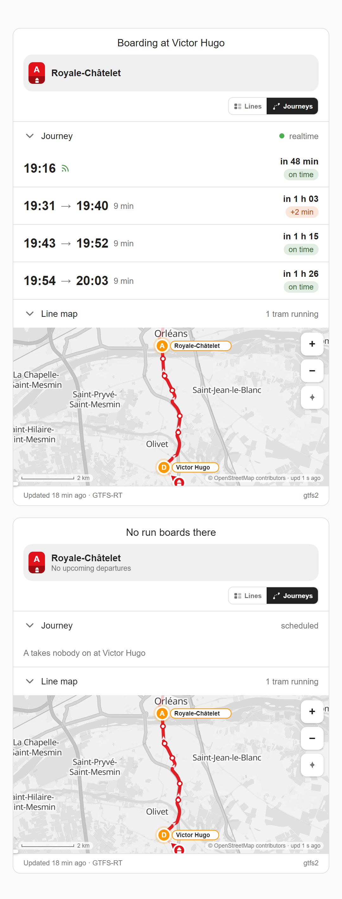

*Above, a trip from Victor Hugo to Royale-Châtelet, part way along tram A: two runs take nobody on there and are not listed; the third sets nobody down at Royale-Châtelet and has no arrival. Below, the same boarding when no run takes anybody on.*

## The map

A vector base map ([MapLibre](https://maplibre.org/), [VersaTiles](https://versatiles.org/) styles on OpenStreetMap data) following the Home Assistant theme, light or dark. On it, the route shapes with direction arrows, their stops in order, the origin station, and the realtime vehicles, each with its mode's glyph and a heading arrow. Stops name themselves once the view is tight enough. Hover or tap a stop to see its name and the other lines of the card that call there. Markers keep a readable size at any zoom.

- **Mouse**: drag to pan, **Ctrl + wheel** to zoom (the plain wheel keeps scrolling the page), double-click to zoom in.
- **Touch**: two fingers to pan and pinch (one finger keeps scrolling the page).
- **Buttons**: zoom in and out, recenter after a manual move, and *Overview* while tracking.
- Line badges, destination chips, section heads and vehicles are keyboard operable (Tab, then Enter).

**Tracking**: tap a vehicle to follow it. The map zooms onto it, the route already travelled turns dashed and grey, and a popup gives the vehicle's terminus, its next stop and its estimated speed. The view follows the vehicle at every refresh. The popup's cross, `Escape` or a tap on the map background stop tracking and leave the map where it is. *Overview* stops tracking and resets the view, and also drops the destination picked. When the vehicle leaves the feed, the map goes back to the whole view and says so.

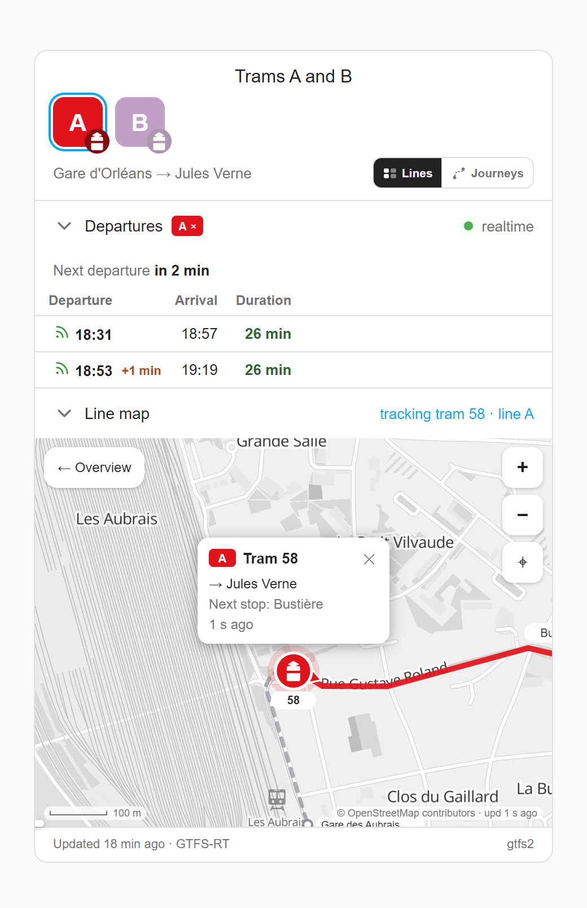

*Following tram 58 on line A: the route behind it turns dashed, and the popup names its terminus and its next stop.*

The browser loads the MapLibre library, the style, the tiles and the fonts itself (from jsDelivr and VersaTiles), so it needs the internet. Without WebGL or without the library, the routes and vehicles still draw on a plain background, and the map's footer says why. `map_style` sets another base map: a MapLibre style URL, or a raster `{z}/{x}/{y}` tile URL.

The card keeps its requests light: files are shared between cards showing the same line, polling pauses while the browser tab is hidden and slows down five times while the map pane is collapsed, and a burst of sensor updates is drawn once. A realtime source is judged fresh from its positions file's own date. A line whose file has not been rewritten for 8 minutes drops its vehicles from the map, and vehicles left over after the end of service are hidden.

## Chip and badge marks

A destination chip in the *Journeys* view is also the status display of the lines that go there. Its plates carry the lines and their modes, and three corners each have one fixed meaning, marked by a small round disc. A line badge in the *Lines* view carries the same marks, its mode at the bottom right. Every mark is also in the tooltip and is read out by screen readers. The images below are cut from the card itself, with the states produced by real data (a line with no service, a positions file that does not exist), not drawn by hand.

| Position | Marks | Meaning |
|---|---|---|
| Line plates<br><picture><source media="(prefers-color-scheme: dark)" srcset="images/pip-pos-mode-dark.png">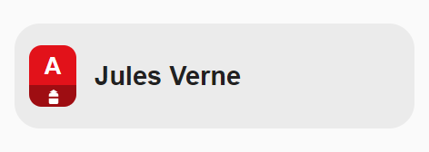</picture> | <picture><source media="(prefers-color-scheme: dark)" srcset="images/pip-bus-dark.png">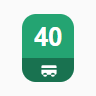</picture> <picture><source media="(prefers-color-scheme: dark)" srcset="images/pip-tram-dark.png"></picture> <picture><source media="(prefers-color-scheme: dark)" srcset="images/pip-metro-dark.png"></picture> <picture><source media="(prefers-color-scheme: dark)" srcset="images/pip-train-dark.png"></picture> <picture><source media="(prefers-color-scheme: dark)" srcset="images/pip-trolleybus-dark.png"></picture> <picture><source media="(prefers-color-scheme: dark)" srcset="images/pip-ferry-dark.png"></picture> | **Line and mode.** One plate per line the destination is reached by: its number on its colour, and on the band at its foot its mode, from the sensor's route type. Here bus, tram, metro, train, trolleybus and ferry; gondola, funicular, monorail, taxi, plane and a generic vehicle complete the set. `mode_icons: false` drops the band and keeps the number. |
| Top left<br><picture><source media="(prefers-color-scheme: dark)" srcset="images/pip-pos-tl-dark.png">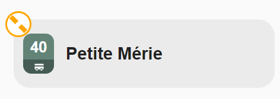</picture> | <picture><source media="(prefers-color-scheme: dark)" srcset="images/pip-mute-dark.png"></picture> | **Quiet source.** The realtime source of a line has stopped answering: the sensor is gone from Home Assistant or unavailable, or its positions file is unreachable or has not been rewritten for 8 minutes. The line's plate loses its colour while it lasts, and the tooltip says which it is and since when. |
| Top right<br><picture><source media="(prefers-color-scheme: dark)" srcset="images/pip-pos-tr-dark.png">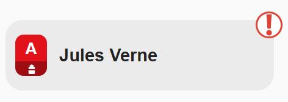</picture> | <picture><source media="(prefers-color-scheme: dark)" srcset="images/pip-alert-dark.png"></picture> <picture><source media="(prefers-color-scheme: dark)" srcset="images/pip-works-dark.png"></picture> <picture><source media="(prefers-color-scheme: dark)" srcset="images/pip-incident-dark.png"></picture> | **Operator alert** on a line or on one of its runs (GTFS-RT alerts): an exclamation mark for a disruption, a cone for engineering works, a bolt for an incident. The cone and the bolt need the alert's cause (see [Requirements](#requirements)); without it the generic mark shows, never a cone that would be wrong about a strike. |
| Bottom left<br><picture><source media="(prefers-color-scheme: dark)" srcset="images/pip-pos-bl-dark.png">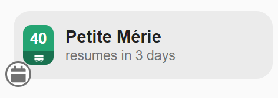</picture> | <picture><source media="(prefers-color-scheme: dark)" srcset="images/pip-tomorrow-dark.png"></picture> <picture><source media="(prefers-color-scheme: dark)" srcset="images/pip-days-dark.png"></picture> <picture><source media="(prefers-color-scheme: dark)" srcset="images/pip-never-dark.png"></picture> | **Resting line.** Nothing runs there today, and the chip says in words when it is back: a dial for tomorrow, a calendar for *n* days, a cross when no service is scheduled at all. |

## Options

### Card

| Option | Default | Description |
|---|---|---|
| `lines` | *required* | The lines and journeys: see [Entries](#entries). |
| `title` | none | A title above the header. `""` hides it too. |
| `max_departures` | `4` | Rows on the board. On a board of journeys, the runs of all of them. |
| `max_transfer_wait` | `120` | Longest wait at a change, in minutes (at least 5). A run that would wait longer is not offered. |
| `trips` | none | Where you go: `[from, to]`, or `{from, to, name, destination_color}`. The card finds the ways on the lines, both ways round: see [Lines and journeys](#lines-and-journeys). |
| `max_changes` | `5` | Most changes on a way the card finds for a trip. |
| `places` | none | Stops the header treats as one place: `{shown name: [stop names]}`. |
| `show_departures` | `true` | The departures pane. `false` makes a map-only card. |
| `show_duration` | `false` | Arrival time and journey duration on each row of the list. The table always shows them. |
| `show_map` | `true` | The map pane. `false` makes a departures-only card. |
| `mode_icons` | `true` | The mode glyph on line badges and on the band of the chips' plates. `false` leaves the line's number alone. |
| `refresh` | `60` | How often the map reads the vehicle positions, in seconds (at least 15). |
| `map_style` | `auto` | `auto` follows the theme, `light` and `dark` force one, or your own base map: a MapLibre style JSON URL, or a raster `{z}/{x}/{y}` tile URL. |
| `map_aspect` | `2/1` | The map's aspect ratio, e.g. `"4/3"`. By default it switches to `4/3` under 380 px. |
| `station_color` | theme accent | The origin station marker's colour. |
| `latitude`, `longitude` | located on the route | The origin station's position, when the card cannot find it on the route. |
| `entity` | | A single sensor, the short form of a one-entry `lines`. With it, `line`, `line_color`, `positions_url` and `route_url` also work at card level. |

### Entries

An entry of `lines` is a sensor id, or an object with these keys:

| Key | Description |
|---|---|
| `entity` | The gtfs2 sensor. |
| `line` | The badge label (default: the route's short name). |
| `color` | The line's colour (default: the route's colour). |
| `positions_url` | The vehicle positions file (default: named by the sensor, or derived from its route and direction the way gtfs2 names it). |
| `route_url` | The route shape file (default: likewise). |

Explicit values always win over derived ones. The collapsed panes, the view, the layout and the picks of the header are remembered per card and per browser.

## Visual editor

The editor covers the whole configuration. Its sections follow the order the card reads: *General*, *Lines* (each sensor and the settings of its line, what the card derived from it shown beside them), *Trips*, *Places*, *Departures and journeys* and *Map*. Past three lines, each one is folded to a summary (its badge, where it runs from and to) and opens on a tap. Trips and places fold the same way: a trip to where it goes and how many ways the card finds for it, in red when it finds none; a place to its name and the stops it groups. A trip's ends are picked among the places and the stops of the card's lines. The *Departures* and *Map* sections open on their pane's switch and show that pane's options only while it is on. The editor never rewrites a value you did not touch, so a hand-written YAML keeps its shape.

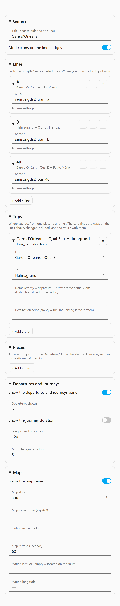

## Translating

The card is served exactly as it sits in `dist/`: `gtfs2-live-card.js`, plus one file per language under `dist/lang/`, each holding the strings of the card *and* of the editor. There is no build step: the language files are loaded at runtime from wherever the card was installed.

To fix a translation, edit `dist/lang/<code>.js` and reload the dashboard. Then check that nothing drifted:

```bash
python build.py --check   # every language carries exactly the keys English has
```

To add a language, copy `dist/lang/en.js`, translate the values, and add its code to `LANGS` in `dist/gtfs2-live-card.js`. CI runs the same check, so a missing or extra key fails there rather than showing raw string keys on someone's dashboard.

## Limitations

- Without the gtfs2 route export (before 0.5.9.8) there is no shape and no ordered stops, so no journey can be timed; the map shows each vehicle's recent path, dashed.
- On a gtfs2 that does not name the trip behind each realtime time, a realtime time is paired with a scheduled one only within 10 minutes, so the card never claims a wrong delay. A run later than that shows twice: once as realtime, once as scheduled.
- A cancelled run can be struck through only if the card listed it before the feed cancelled it: gtfs2 then drops it from the sensor at once and keeps only its id, so a card opened afterwards has no time to strike.
- gtfs2 exports no speed, heading or per-vehicle timestamp. The card estimates heading and speed from successive positions, so the speed needs two distinct positions, and freshness is known per file, not per vehicle.

## License

[MIT](LICENSE)
